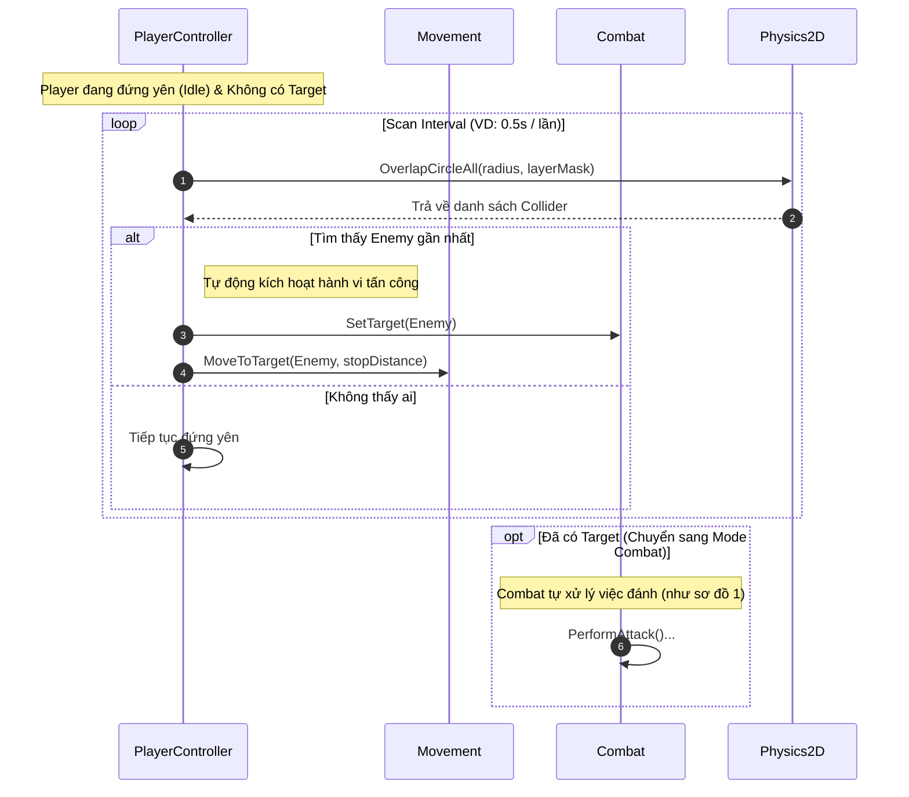

```mermaid
sequenceDiagram
    autonumber
    participant Ctrl as PlayerController
    participant Move as Movement
    participant Combat as Combat
    participant Physics as Physics2D

    Note over Ctrl: Player đang đứng yên (Idle) & Không có Target
    
    loop Scan Interval (VD: 0.5s / lần)
        Ctrl->>Physics: OverlapCircleAll(radius, layerMask)
        Physics-->>Ctrl: Trả về danh sách Collider
        
        alt Tìm thấy Enemy gần nhất
            Note right of Ctrl: Tự động kích hoạt hành vi tấn công
            Ctrl->>Combat: SetTarget(Enemy)
            Ctrl->>Move: MoveToTarget(Enemy, stopDistance)
        else Không thấy ai
            Ctrl->>Ctrl: Tiếp tục đứng yên
        end
    end

    opt Đã có Target (Chuyển sang Mode Combat)
        Note over Combat: Combat tự xử lý việc đánh (như sơ đồ 1)
        Combat->>Combat: PerformAttack()...
    end
```