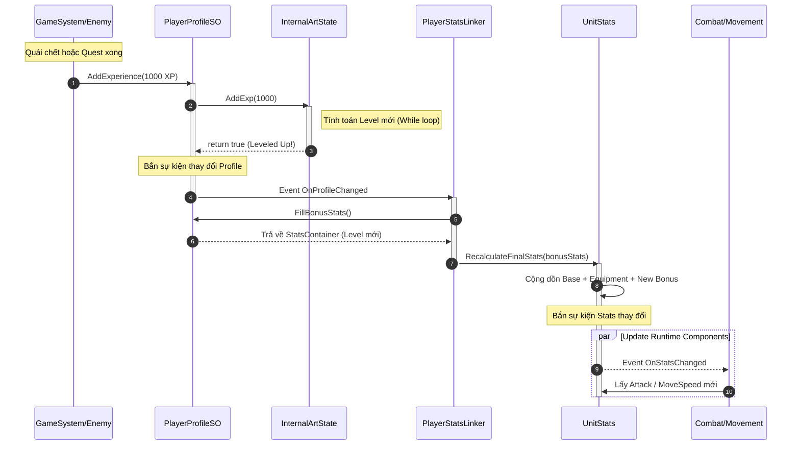

```mermaid
sequenceDiagram
    autonumber
    participant Game as GameSystem/Enemy
    participant Profile as PlayerProfileSO
    participant Art as InternalArtState
    participant Linker as PlayerStatsLinker
    participant Stats as UnitStats
    participant Components as Combat/Movement

    Note over Game: Quái chết hoặc Quest xong
    Game->>Profile: AddExperience(1000 XP)
    activate Profile
    
    Profile->>Art: AddExp(1000)
    activate Art
    note right of Art: Tính toán Level mới (While loop)
    Art-->>Profile: return true (Leveled Up!)
    deactivate Art

    Note over Profile: Bắn sự kiện thay đổi Profile
    Profile->>Linker: Event OnProfileChanged
    deactivate Profile

    activate Linker
    Linker->>Profile: FillBonusStats()
    Profile-->>Linker: Trả về StatsContainer (Level mới)
    
    Linker->>Stats: RecalculateFinalStats(bonusStats)
    deactivate Linker

    activate Stats
    Stats->>Stats: Cộng dồn Base + Equipment + New Bonus
    
    Note over Stats: Bắn sự kiện Stats thay đổi
    par Update Runtime Components
        Stats-->>Components: Event OnStatsChanged
        Components->>Stats: Lấy Attack / MoveSpeed mới
    end
    deactivate Stats
```