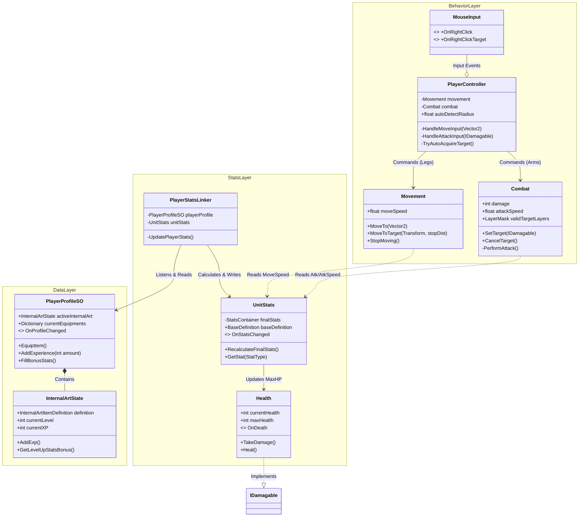
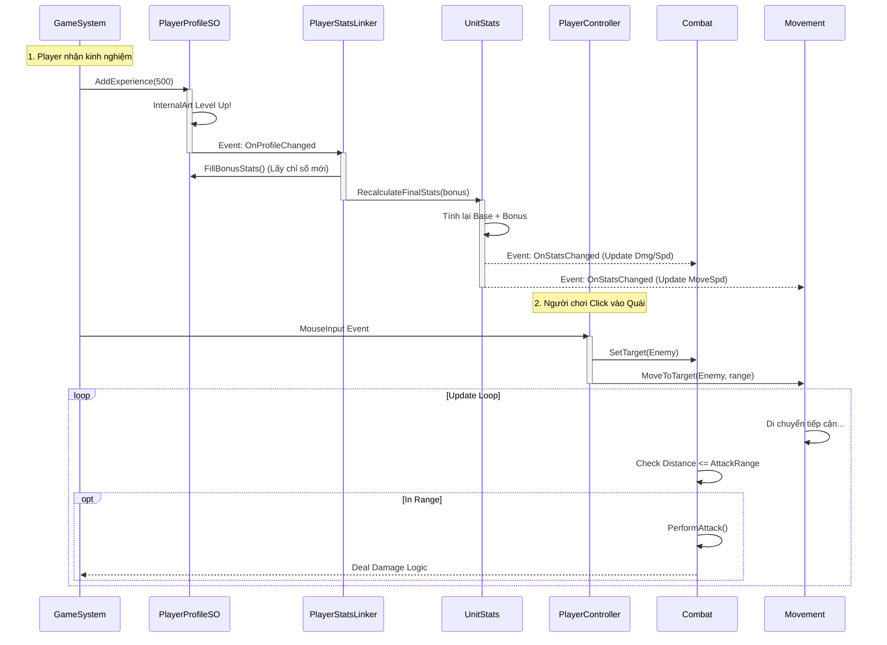

# Player System Documentation

Tài liệu này mô tả kiến trúc tổng thể của Object **Player**, bao gồm luồng dữ liệu (Data Flow) và luồng điều khiển hành vi (Behavior Logic).

## 1. High-Level Class Diagram (Cấu trúc tổng thể)

Sơ đồ này chia hệ thống thành 3 tầng:
1.  **Data Layer:** Lưu trữ dữ liệu bền vững (Inventory, XP, Level).
2.  **Bridge Layer:** Đồng bộ dữ liệu xuống Runtime.
3.  **Runtime Behavior:** Xử lý logic game (Di chuyển, Tấn công, Input).

---

## 2. Chi tiết chức năng (Component Breakdown)

### A. Data & Stats (Dữ liệu & Chỉ số)
* **`PlayerProfileSO`**: [ScriptableObject] File save của nhân vật. Quản lý việc trang bị đồ và tính toán XP cho "Nội công" (`InternalArtState`).
* **`PlayerStatsLinker`**: [MonoBehaviour] Cầu nối. Mỗi khi Profile thay đổi (lên cấp, đổi đồ), nó lấy chỉ số cộng thêm và nạp vào `UnitStats`.
* **`UnitStats`**: [MonoBehaviour] "Single Source of Truth" cho chỉ số thực tế. Nó cộng gộp: `Base Stats` + `Equipment Bonus` + `Buffs`.
* **`Health`**: [MonoBehaviour] Quản lý máu. Tự động cập nhật `MaxHealth` khi `UnitStats` thay đổi.

### B. Controller & Behavior (Điều khiển - Mới Refactor)
* **`PlayerController`**: [MonoBehaviour] **Bộ não**.
    * Lắng nghe `MouseInput`.
    * Quyết định khi nào thì `Movement` chạy, khi nào thì `Combat` đánh.
    * Chứa logic **Auto-Target** (tự tìm quái khi đứng yên).
* **`Movement`**: [MonoBehaviour] **Đôi chân**.
    * Chỉ biết di chuyển tới điểm A hoặc bám theo Object B.
    * Lấy `MoveSpeed` từ `UnitStats`.
* **`Combat`**: [MonoBehaviour] **Đôi tay**.
    * Chỉ biết tấn công mục tiêu được giao (`SetTarget`).
    * Lấy `Damage`, `AttackSpeed` từ `UnitStats`.
    * Có thể dùng chung cho Enemy (chỉ cần đổi `validTargetLayers`).

---

## 3. Sequence Diagram: Full Gameplay Loop

Sơ đồ dưới đây mô tả một vòng lặp game đầy đủ: Từ lúc nhận XP -> Lên cấp -> Cập nhật chỉ số -> Người chơi điều khiển đánh quái.

## 4. Hướng dẫn Setup Prefab (Quick Setup)

Để tạo một Player hoàn chỉnh từ các script trên:

1.  Tạo GameObject **Player**.
2.  Gắn **`Rigidbody2D`** (Gravity Scale = 0, Freeze Rotation Z).
3.  Gắn **`UnitStats`** (Kéo file BaseStats SO vào).
4.  Gắn **`Health`** (Sẽ tự link với UnitStats).
5.  Gắn **`Movement`** (Sẽ tự link với UnitStats).
6.  Gắn **`Combat`** (Sẽ tự link với UnitStats).
    * *Lưu ý:* Set `Valid Target Layers` là **Enemy**.
7.  Gắn **`PlayerController`** (Sẽ tự tìm Movement và Combat).
    * *Tùy chỉnh:* `Auto Detect Radius` = 5.
8.  Gắn **`PlayerStatsLinker`** (Kéo file `PlayerProfileSO` vào).